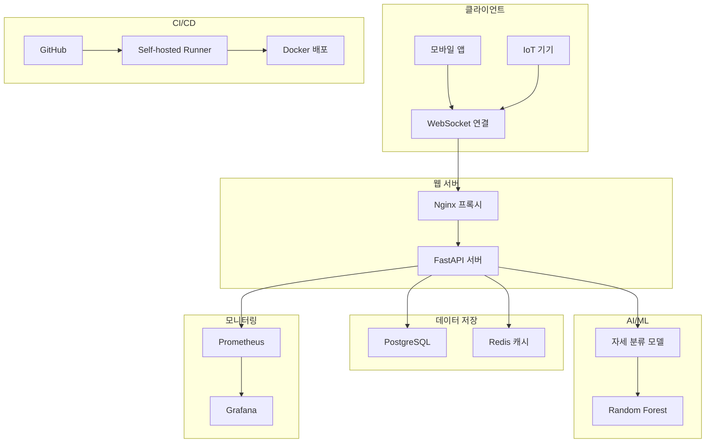

# 🤸‍♂️ 실시간 자세 분류 시스템


IMU 센서 데이터를 실시간으로 분석하여 사용자의 자세를 분류하는 웹소켓 기반 AI 시스템입니다.

---

## 📋 목차

- [시스템 개요](#-시스템-개요)
- [아키텍처](#-아키텍처)
- [주요 기능](#-주요-기능)
- [기술 스택](#-기술-스택)
- [프로젝트 구조](#-프로젝트-구조)
- [빠른 시작](#-빠른-시작)
- [API 사용법](#-api-사용법)
- [개발 가이드](#-개발-가이드)
- [배포 및 운영](#-배포-및-운영)
- [모니터링](#-모니터링)
- [문제 해결](#-문제-해결)
- [기여하기](#-기여하기)

---

## 🎯 시스템 개요

### 목적

모바일 앱이나 IoT 기기에서 전송되는 IMU(Inertial Measurement Unit) 센서 데이터를 실시간으로 분석하여 사용자의 자세를 8가지 카테고리(0~7번 자세)로 분류합니다.

### 주요 특징

- **실시간 처리**: 웹소켓을 통한 실시간 데이터 통신
- **머신러닝 기반**: Random Forest 분류기로 정확한 자세 인식
- **확장 가능**: Docker 컨테이너 기반 마이크로서비스 아키텍처
- **모니터링**: Prometheus + Grafana 통합 모니터링
- **자동화**: GitHub Actions 기반 CI/CD 파이프라인

---

## 🏗 아키텍처



### 데이터 흐름

1. **데이터 수신**: 클라이언트에서 `{"timestamp": 15420, "relativePitch": -25.73}` 전송
2. **특징 추출**: 시계열 데이터에서 14개 통계적 특징 추출
3. **모델 예측**: Random Forest 모델로 자세 분류
4. **결과 반환**: 예측된 자세 번호와 확신도 반환
5. **로깅**: 모든 예측 결과를 데이터베이스에 저장

---

## ✨ 주요 기능

### 🤖 AI/ML 기능

- **특징 추출**: 평균, 표준편차, 분위수, 변화율, 안정성 등 14개 특징
- **실시간 예측**: 단일 데이터 포인트에서 즉시 자세 분류
- **확신도 제공**: 예측 결과의 신뢰도 측정
- **모델 버전 관리**: 모델 성능 추적 및 버전 관리

### 🌐 웹 서비스

- **WebSocket API**: 실시간 양방향 통신
- **REST API**: 헬스체크 및 상태 확인
- **웹 테스트 클라이언트**: 브라우저에서 바로 테스트 가능
- **CORS 지원**: 크로스 오리진 요청 허용

### 📊 데이터 관리

- **예측 로그**: 모든 예측 결과 저장 및 추적
- **연결 로그**: 클라이언트 연결 이력 관리
- **성능 메트릭**: 모델 성능 지표 저장
- **실시간 대시보드**: 시간별 통계 및 트렌드 분석

### 🔧 운영 도구

- **헬스체크**: 시스템 상태 자동 모니터링
- **로그 관리**: 구조화된 로깅 및 로테이션
- **에러 추적**: 예외 발생 시 자동 알림
- **성능 모니터링**: CPU, 메모리, 응답시간 추적

---

## 🛠 기술 스택

### Backend

- **Python 3.13**: 메인 프로그래밍 언어
- **FastAPI**: 웹 프레임워크 및 WebSocket 서버
- **scikit-learn**: 머신러닝 라이브러리
- **pandas/numpy**: 데이터 처리 및 분석
- **SQLAlchemy**: ORM 및 데이터베이스 연동

### Database

- **PostgreSQL 15**: 메인 데이터베이스
- **Redis 7**: 캐싱 및 세션 관리

### Infrastructure

- **Docker & Docker Compose**: 컨테이너 오케스트레이션
- **Nginx**: 리버스 프록시 및 로드 밸런싱
- **Prometheus**: 메트릭 수집
- **Grafana**: 모니터링 대시보드

### DevOps

- **GitHub Actions**: CI/CD 파이프라인
- **Self-hosted Runner**: 전용 빌드 서버
- **Blue-Green Deployment**: 무중단 배포

---

## 📁 프로젝트 구조

```
arduino/
├── 📄 README.md                    # 프로젝트 메인 문서
├── 📄 DEPLOYMENT.md                # 배포 가이드
├── 📄 requirements.txt             # Python 의존성
├── 📄 Dockerfile                   # Docker 이미지 빌드
├── 📄 docker-compose.yml           # 개발 환경
├── 📄 docker-compose.staging.yml   # 스테이징 환경
├── 📄 docker-compose.prod.yml      # 프로덕션 환경
├── 📄 init.sql                     # 데이터베이스 초기화
├── 📄 setup-runner.sh              # Self-hosted runner 설정
│
├── 🧠 AI/ML 모듈
│   ├── 📄 posture_classifier.py    # 자세 분류 모델
│   ├── 📄 posture_model.pkl        # 학습된 모델 파일
│   └── 📁 자세모음/                # 훈련 데이터
│       ├── 📁 다혜/
│       ├── 📁 도엽/
│       └── 📁 준형/
│
├── 🌐 웹 서비스
│   ├── 📄 websocket_server.py      # FastAPI 웹소켓 서버
│   └── 📁 client_examples/         # 클라이언트 예제
│       └── 📄 AndroidWebSocketClient.java
│
├── 🧪 테스트
│   └── 📁 tests/
│       └── 📄 test_posture_system.py
│
├── 🚀 CI/CD
│   └── 📁 .github/workflows/
│       └── 📄 ci-cd.yml            # GitHub Actions 워크플로우
│
├── 📊 모니터링 설정
│   ├── 📄 prometheus.yml           # Prometheus 설정
│   ├── 📄 nginx.conf               # Nginx 설정
│   └── 📄 grafana-dashboard.json   # Grafana 대시보드
│
└── 📝 로그
    ├── 📄 posture_classifier.log   # 모델 로그
    ├── 📄 websocket_server.log     # 서버 로그
    └── 📁 logs/                    # 컨테이너 로그
```

---

## 🚀 빠른 시작

### 1. 저장소 클론

```bash
git clone https://github.com/YamYamee/soft_electronic.git
cd soft_electronic
```

### 2. 환경 설정

```bash
# 환경 변수 파일 복사 및 수정
cp .env.example .env
# .env 파일을 편집하여 서버 주소 등 설정

# Python 가상환경 생성 (선택사항)
python -m venv venv
source venv/bin/activate  # Linux/Mac
# 또는
venv\\Scripts\\activate     # Windows

# 시스템 의존성 설치 (Ubuntu/Debian)
sudo apt-get update
sudo apt-get install -y postgresql-server-dev-all libpq-dev build-essential

# Python 의존성 설치
pip install -r requirements.txt
```

### 환경 변수 설정
주요 환경 변수들을 `.env` 파일에서 설정할 수 있습니다:

| 변수명 | 기본값 | 설명 |
|--------|--------|------|
| `SERVER_HOST` | localhost | 서버 호스트 주소 |
| `SERVER_PORT` | 8000 | 서버 포트 번호 |
| `ENVIRONMENT` | development | 실행 환경 (development/staging/production) |
| `LOG_LEVEL` | INFO | 로그 레벨 (DEBUG/INFO/WARNING/ERROR) |
| `DATABASE_URL` | postgresql://... | 데이터베이스 연결 URL |
| `REDIS_URL` | redis://... | Redis 서버 URL |

### 3. Docker 환경 실행

```bash
# 전체 스택 실행
docker-compose up -d

# 서비스 상태 확인
docker-compose ps
```

### 4. 서비스 접속

- **웹 테스트 클라이언트**: http://localhost:8000
- **API 문서**: http://localhost:8000/docs
- **헬스체크**: http://localhost:8000/health
- **Grafana 대시보드**: http://localhost:3000 (admin/admin123)

---

## 📡 API 사용법

### WebSocket 연결

```javascript
// 동적 서버 주소 감지 (권장)
const protocol = window.location.protocol === 'https:' ? 'wss:' : 'ws:';
const wsUrl = `${protocol}//${window.location.host}/ws`;
const ws = new WebSocket(wsUrl);

// 또는 직접 지정
// const ws = new WebSocket('ws://your-server-ip:8000/ws');

ws.onopen = function () {
  console.log("연결됨");
};

ws.onmessage = function (event) {
  const data = JSON.parse(event.data);
  console.log("예측 결과:", data);
};
```

### 데이터 전송 형식

```json
{
  "timestamp": 15420,
  "relativePitch": -25.73
}
```

### 응답 형식

```json
{
  "type": "prediction",
  "predicted_posture": 2,
  "confidence": 0.85,
  "all_probabilities": {
    "0": 0.05,
    "1": 0.1,
    "2": 0.85,
    "3": 0.0
  },
  "input_timestamp": 15420,
  "input_relative_pitch": -25.73,
  "server_timestamp": "2025-08-27T00:06:54"
}
```

### 자세 분류 카테고리

| 자세 번호 | 설명        |
| --------- | ----------- |
| 0         | 기본 자세   |
| 1         | 전방 기울임 |
| 2         | 후방 기울임 |
| 3         | 좌측 기울임 |
| 4         | 우측 기울임 |
| 5         | 복합 자세 1 |
| 6         | 복합 자세 2 |
| 7         | 복합 자세 3 |

---

## 👨‍💻 개발 가이드

### 로컬 개발 환경 설정

```bash
# 모델 훈련
python posture_classifier.py

# 서버 실행 (개발 모드)
uvicorn websocket_server:app --reload --host 0.0.0.0 --port 8000

# 테스트 실행
pytest tests/ -v --cov=.

# 코드 품질 검사
black . --check
isort . --check-only
flake8 .
```

### 새로운 특징 추가

1. `posture_classifier.py`의 `extract_features()` 메서드 수정
2. 모델 재훈련: `python posture_classifier.py`
3. 테스트 추가: `tests/test_posture_system.py`

### 새로운 API 엔드포인트 추가

1. `websocket_server.py`에 라우터 추가
2. API 문서 자동 업데이트됨 (FastAPI)
3. 테스트 케이스 작성

### 데이터베이스 스키마 변경

1. `init.sql` 파일 수정
2. 마이그레이션 스크립트 작성
3. Docker 컨테이너 재생성

---

## 🚀 배포 및 운영

### Self-hosted Runner 설정

```bash
# 환경 변수 설정
export GITHUB_TOKEN="your_github_token"
export GITHUB_REPO="YamYamee/soft_electronic"

# Runner 설치
chmod +x setup-runner.sh
./setup-runner.sh
```

### GitHub Secrets 설정

Repository Settings > Secrets에서 다음 변수들을 설정:

- `PROD_DATABASE_URL`
- `STAGING_DATABASE_URL`
- `POSTGRES_PROD_PASSWORD`
- `SLACK_WEBHOOK`

### 배포 프로세스

1. **자동 배포**: `git push origin main` (프로덕션)
2. **수동 배포**: GitHub Actions에서 workflow_dispatch 실행
3. **롤백**: 자동 감지 후 이전 버전으로 복구

### 환경별 설정

- **개발**: `docker-compose.yml`
- **스테이징**: `docker-compose.staging.yml`
- **프로덕션**: `docker-compose.prod.yml`

---

## 📊 모니터링

### 주요 메트릭

- **응답 시간**: API 요청 처리 시간
- **예측 정확도**: 모델 성능 지표
- **연결 수**: 동시 WebSocket 연결 수
- **에러율**: 시간당 에러 발생 빈도
- **리소스 사용량**: CPU, 메모리, 디스크

### 대시보드 접속

- **Grafana**: http://localhost:3000
  - Username: `admin`
  - Password: `admin123`

### 알림 설정

- **Slack**: 배포 성공/실패, 시스템 에러
- **Email**: 크리티컬 시스템 장애
- **Discord**: 개발팀 실시간 알림

### 로그 확인

```bash
# 애플리케이션 로그
docker-compose logs -f posture_server

# 데이터베이스 로그
docker-compose logs -f postgres

# 전체 로그
docker-compose logs -f
```

---

## 🔧 문제 해결

### 자주 발생하는 문제

#### 1. WebSocket 연결 실패

```bash
# 방화벽 확인
sudo ufw status

# 포트 사용 확인
netstat -tlnp | grep 8000

# 컨테이너 상태 확인
docker-compose ps
```

#### 2. 모델 예측 실패

```bash
# 모델 파일 확인
ls -la posture_model.pkl

# 모델 재훈련
python posture_classifier.py

# 로그 확인
tail -f posture_classifier.log
```

#### 3. 데이터베이스 연결 문제

```bash
# 데이터베이스 상태 확인
docker-compose exec postgres pg_isready

# 데이터베이스 접속 테스트
docker-compose exec postgres psql -U posture_user -d posture_classification

# 로그 확인
docker-compose logs postgres
```

#### 4. CI/CD 실패

```bash
# Runner 상태 확인
sudo systemctl status actions.runner.*

# Runner 재시작
sudo systemctl restart actions.runner.*

# GitHub Token 권한 확인
curl -H "Authorization: token $GITHUB_TOKEN" https://api.github.com/user
```

### 성능 최적화

#### 데이터베이스 튜닝

```sql
-- 인덱스 추가
CREATE INDEX CONCURRENTLY idx_prediction_logs_created_at
ON prediction_logs(created_at);

-- 쿼리 성능 분석
EXPLAIN ANALYZE SELECT * FROM prediction_logs
WHERE created_at >= NOW() - INTERVAL '1 day';
```

#### 캐시 최적화

```python
# Redis 캐시 설정
CACHE_TTL = 3600  # 1시간
redis_client.setex(f"prediction:{user_id}", CACHE_TTL, result)
```

---

## 🤝 기여하기

### 개발 워크플로우

1. **Issue 생성**: 버그 리포트 또는 기능 요청
2. **브랜치 생성**: `feature/new-feature` 또는 `bugfix/issue-123`
3. **개발 및 테스트**: 로컬에서 개발 후 테스트 실행
4. **Pull Request**: 코드 리뷰 요청
5. **코드 리뷰**: 팀원 검토 후 승인
6. **배포**: 자동 CI/CD 파이프라인 실행

### 코딩 규칙

- **Python**: PEP 8 스타일 가이드 준수
- **커밋 메시지**: `type: description` 형식
- **테스트**: 새로운 기능에 대한 테스트 필수
- **문서화**: README 및 API 문서 업데이트

### 이슈 리포팅

- **버그**: 재현 단계, 예상/실제 결과, 환경 정보
- **기능 요청**: 사용 사례, 기대 효과, 우선순위
- **문서**: 개선사항, 누락된 정보, 명확하지 않은 부분

---

## 📞 지원 및 연락처

### 개발팀

- **Repository**: https://github.com/YamYamee/soft_electronic
- **Issues**: https://github.com/YamYamee/soft_electronic/issues
- **Discussions**: https://github.com/YamYamee/soft_electronic/discussions

### 문서

- **API 문서**: http://localhost:8000/docs
- **배포 가이드**: [DEPLOYMENT.md](DEPLOYMENT.md)
- **아키텍처**: docs/architecture.md

---

## 📜 라이선스

이 프로젝트는 MIT 라이선스 하에 배포됩니다. 자세한 내용은 [LICENSE](LICENSE) 파일을 참조하세요.

---

## 🙏 감사의 말

이 프로젝트는 다음 오픈소스 프로젝트들의 도움을 받았습니다:

- [FastAPI](https://fastapi.tiangolo.com/)
- [scikit-learn](https://scikit-learn.org/)
- [Docker](https://www.docker.com/)
- [PostgreSQL](https://www.postgresql.org/)
- [Grafana](https://grafana.com/)

---

<p align="center">
  <strong>🤸‍♂️ 실시간 자세 분류 시스템으로 더 건강한 자세를 만들어보세요!</strong>
</p>
