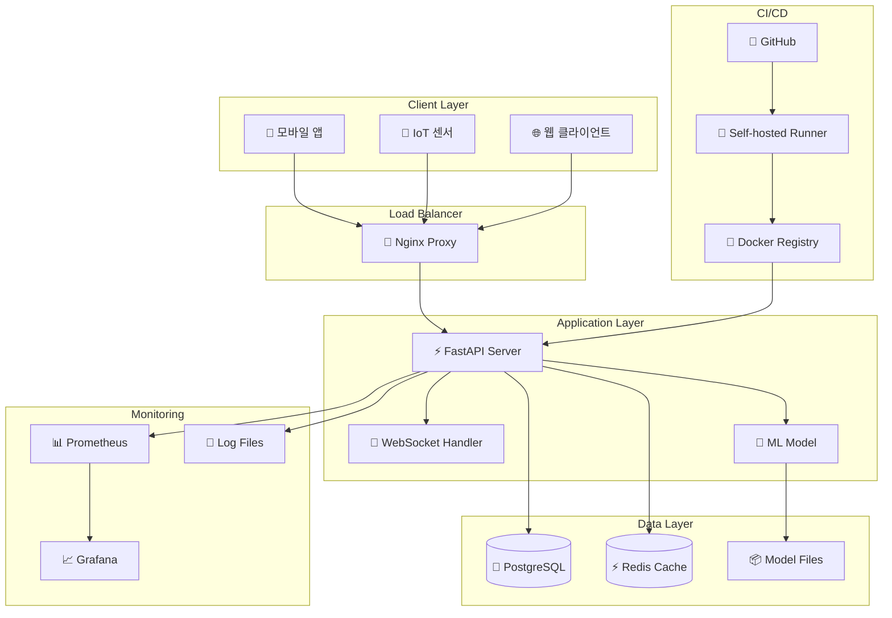

# 🏗 시스템 아키텍처

## 개요

자세 분류 시스템은 마이크로서비스 아키텍처를 기반으로 구축된 실시간 AI 서비스입니다.

## 아키텍처 다이어그램



## 컴포넌트 상세

### 1. Client Layer (클라이언트 계층)

- **모바일 앱**: Android/iOS 앱에서 IMU 센서 데이터 전송
- **IoT 센서**: 하드웨어 기기에서 직접 데이터 전송
- **웹 클라이언트**: 브라우저 기반 테스트 클라이언트

### 2. Load Balancer (로드 밸런서)

- **Nginx**: 리버스 프록시, SSL 터미네이션, 로드 밸런싱
- **기능**:
  - HTTP/HTTPS 요청 처리
  - WebSocket 프록시
  - 정적 파일 서빙
  - 압축 및 캐싱

### 3. Application Layer (애플리케이션 계층)

- **FastAPI Server**: 메인 웹 서버
  - REST API 엔드포인트
  - WebSocket 핸들러
  - 미들웨어 (로깅, CORS, 인증)
- **ML Model**: Random Forest 기반 자세 분류기
  - 특징 추출 엔진
  - 실시간 예측 처리
  - 모델 버전 관리

### 4. Data Layer (데이터 계층)

- **PostgreSQL**: 메인 데이터베이스
  - 예측 로그 저장
  - 연결 이력 관리
  - 모델 성능 메트릭
- **Redis**: 인메모리 캐시
  - 세션 관리
  - 임시 데이터 캐싱
  - 레이트 리미팅
- **Model Files**: 학습된 모델 파일
  - pickle 형태로 저장
  - 버전별 관리

### 5. Monitoring (모니터링)

- **Prometheus**: 메트릭 수집
- **Grafana**: 시각화 대시보드
- **Log Files**: 구조화된 로그 저장

### 6. CI/CD (지속적 통합/배포)

- **GitHub**: 소스코드 저장소
- **Self-hosted Runner**: 빌드 및 배포 서버
- **Docker Registry**: 컨테이너 이미지 저장소

## 데이터 흐름

### 1. 예측 요청 흐름

```
클라이언트 → Nginx → FastAPI → ML Model → 응답
     ↓
 PostgreSQL (로깅)
```

### 2. 모니터링 데이터 흐름

```
FastAPI → Prometheus → Grafana
   ↓
Log Files
```

### 3. 배포 흐름

```
GitHub Push → Runner → Docker Build → Container Deploy
```

## 보안 고려사항

### 1. 네트워크 보안

- SSL/TLS 암호화
- 방화벽 규칙
- VPN 접근 제한

### 2. 애플리케이션 보안

- 입력 데이터 검증
- SQL 인젝션 방지
- XSS 방지

### 3. 데이터 보안

- 데이터베이스 암호화
- 백업 암호화
- 개인정보 익명화

## 확장성 고려사항

### 1. 수평 확장

- FastAPI 서버 다중 인스턴스
- 로드 밸런서를 통한 트래픽 분산
- 데이터베이스 읽기 복제본

### 2. 수직 확장

- 서버 리소스 증설
- 데이터베이스 성능 튜닝
- 캐시 메모리 확장

### 3. 지역별 확장

- CDN 활용
- 지역별 서버 배치
- 데이터 지역화

## 재해 복구

### 1. 백업 전략

- 데이터베이스 일일 백업
- 코드 저장소 미러링
- 설정 파일 버전 관리

### 2. 복구 절차

- RTO (Recovery Time Objective): 30분
- RPO (Recovery Point Objective): 1시간
- 자동 장애 복구 시스템

### 3. 고가용성

- 다중 가용 영역 배치
- 헬스체크 기반 자동 복구
- 로드 밸런서 장애 조치
